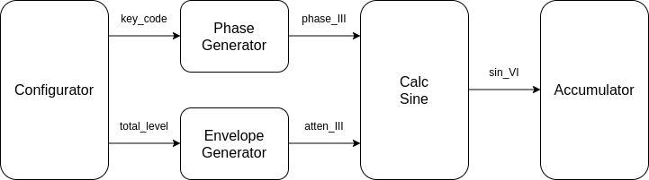

# YM2151 : Step-by-step implementation
# Episode 5 : "Phase and Envelope Generator"

Welcome to the fifth episode of "YM2151 : Step-by-step implementation", where
we add the Phase and Envelope Generator.  The purpose of this episode is to be
able to play simultaneously different sounds from each of the 32 output slots.
Furthermore, we will cleanup the design to prepare for the next episode.

## Naming Convention
Since the design is growing in complexity, and since several modules are
working in parallel and in a pipeline fashion, I have found it convenient to
employ the same naming convention as [jotego](https://github.com/jotego/). So
within a module, a signal name is postfixed with the delay written in roman
numerals. For instance, the signal name\_I is delayed one clock cycle relative
to the input to the module.  I've found this increases readability and helps
spot pipeline errors more easily.

## Configurator
In the previous version the note and attenuation level were hard coded in the
file ym2151.vhd. Now I've made a separate block Configurator, which stores the
configuration of each of the 32 slots.

At each clock cycle this block outputs the slot number and the corresponding
configuration for that slot.

In the next episode we will add the configuration interface, i.e. the ability
to set the configuration from outside the module. But for now, some values are
hardcoded to simultaneously play three different notes with each their
attenuation level.

## Phase Generator
The Phase Generator maintains internal state of the current phase of each of
the 32 different slots. The module takes as input the current frequency
information etc. and outputs (a fixed number of clock cycles later) the updated
phase.

Currently, the latency in this module is 3 clock cycles, but that may increase
as more features are implemented.

The current phase of each slot is stored in a ring buffer. This is essentially
a 32-stage pipeline, where the input to the pipeline is calculated from the
output.  In other words, the output of the pipeline contains the previous value
of the phase for the slot, and the input to the pipeline is the new value of
the phase.  Since the pipeline is 32 stages deep (the same as the number of
slots), there is an implied correspondance between the slot number and the
phase value. For that reason, the phase generator does not need to know the
current slot number.

## Envelope Generator
The Envelope Generator is currently just a stub, in that it just calculates the
attenuation level (to be input to the calc\_sine module) from the total\_level
values (received from the configurator module). This calculation is a simple
shift by three bits.

Furthermore there is a seemingly rather arbitrary delay of three clock cycles.
This is because the input to the calc\_sine module expects the attenuation
level and the phase value to be available simultaneously. So the Phase Generator
and the Envelope Generator are required to have the same latency.

## Block Diagram
I think it is necessary with a block diagram at this stage.

This block diagram matches very closely the top level source file ym2151.vhd.

## Testing
In the Configurator I've instructed the design to generate three notes: 

* A4 (with frequency 440 Hz) at -12 dB.
* E5 (with frequency 659 Hz) at -24 dB.
* C6 (with frequency 1047 Hz) at -18 dB.

Running the simulation and analyzing with audacity the generated output file
output.wav confirms the above. The same does running the design in the FPGA on
the Nexys4DDR board.

