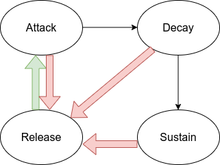

# YM2151 : Step-by-step implementation
# Episode 7 : "Envelope Generator"

Welcome to the seventh episode of "YM2151 : Step-by-step implementation", where
we finish the envelope generator. This is surprisingly complicated, so we'll
take it nice and slowly ...

## Envelope Generator
The Envelope Generator controls the generation of the ADSR envelope. The state
transitions are driven by the keyon\_i signal (i.e. by writes to register
address 0x08), and the time spent in each state is controlled by the remaining
input signals.  The output is the 10-bit attenuation level in units of 1/64'th
powers of 0.5, i.e. a unit of 6/64 dB = 93.75 mdB.

During the attack phase the volume increases approximately linearly, while in
the three decaying phases (DSR), the volume decreases exponentially.  The
exponential decrease in volume is obtained by a simple linear increase in
attenuation. On the other hand, the linear increase in volume (during the
attack phase) is achieved approximately by an exponential decrease in
attenuation.

## Analyzing the attenuation times
According to the [documentation](../../doc/yamaha_ym2151_synthesis.pdf) the
YM2151 operates internally with a 6-bit attenuation rate, i.e. 64 different
rate values. In the three decaying phases (DSR), the full attenuation time
(from 0 dB to 96 dB) varies from 6.727 ms (rates 60-63) to 110209.71 ms (rate
4); rates 0-3 are infinite.  The range of values from rate=4 to rate=60
correspond to a factor of 2^14, so from this observation we conclude that the
attenuation time doubles every time the rate decreases by 4.

The slowest decay rates have the following attenuation times (taken from the
[documentation](../../doc/yamaha_ym2151_synthesis.pdf)):

rate | time (ms) | ratio to previous
-----|-----------|---------------
  4  | 110209.71 |
  5  |  88167.77 | 0.8000
  6  |  73473.14 | 0.8333
  7  |  62976.98 | 0.8571

These values have almost a pair-wise ratio of 0.5^(1/4) = 0.8409, but not
quite.  In fact, the ratios are exactly 4/5, 5/6, and 6/7, respectively.  This
is an artifact of the implementation within the YM2151. We will mimic this
behaviour in the current implementation.

So, apparently the YM2151 needs to keep a separate timer for each of the 32
slots, but that would be very wasteful of resources. Instead, the YM2151 keeps
a single global counter and each slot accesses different slices of that
counter.  This global counter must be slow enough that it at most increments by
one for the duration of all 32 slots.

For reasons that will become clear only later (i.e. I can see into the future!)
we'll now introduce a "fundamental period" of 8\*48 clock cycles, i.e.
8\*48/(3579545/2) = 214.55 us.

Consider now the specific internal rate value of 48. This has a total
attenuation time of 54 ms, which means the attenuation must be incremented once
every approximately 54 us.  Within a single fundamental period, the attenuation
must be incremented 214.55/54 = 4 times approximately.

Proceeding in the same fashion, we get the following table:

Rate | period | increments
---- | ------ | ----------
 48  |  54 us |  215/54 = 4
 49  |  43 us |  215/43 = 5
 50  |  35 us |  215/35 = 6
 51  |  30 us |  215/30 = 7

So, in conclusion, we can achieve attenuation rates 48 to 51 simply by incrementing
the attenuation a variable (4 to 7) number of times within a single fundamental period
of 215 us.

Rates that have values 4 lower (i.e. twice as slow) only increment every second
fundamental period (or slower).  On the other hand rates that have values 4
higher (i.e. twice as fast) increment by value larger than one each time.

## Implementation details

The implementation of the Envelope Generator is split into a number of submodules:

* eg\_state
* eg\_rate
* eg\_timing
* eg\_attenuation

They are connected linearly, so the output from eg\_state is input to the
eg\_rate, etc.

Most of these block are completely combinatorial. This is to save resources,
since there is no need to do any pipelining when the clock frequency is so low.

The main complexity is in the eg\_timing block, which must determine when to
update the attenuation, and by how much.

### Maintaining state information
Before we go into details with the individual blocks, let's discuss what state
information to maintain, and how to do that.

So the state information to be stored within the Envelope Generator is the
following:
* Current envelope state (ADSR).
* Current attenuation level.

Furthermore, we must store some information related to the timing. This turns
out to be just a single bit, but more about that later.

The way we store this state information is to delay it for 32 clock cycles
(corresponding to the 32 slots) using the ring\_buffer. The output of the
ring\_buffer is exactly the previous value of the state.

I've modified the ring\_buffer module to allow specifying a reset value.

### eg\_state
This block controls the state machine of the Envelope Generator.

In the diagram above, the green arrow indicates a "Key ON" event, and the red
arrow indicates a "Key OFF" event.

The thin arrows happen automatically controlled by the current value of the
attenuation.

### eg\_rate
This block generates an internal rate value (0 to 63) based on the current
state and the configuration settings.

### eg\_timing
This block determines when to update the attenuation, and by how much.

This block has three outputs:

* lsb\_o    : Toggles eight times within an update period.
* bit\_o    : Is high if the attenuation should be updated.
* shifts\_o : Determines how much the attenuation should be updated with.

The update period is a power of two times the fundamental period. For rates 48
and above the two are the same.

Each slot accesses a 3-bit slice from this global counter. This slice is used
as index into an array of eight bits. Each '1' bit in this array corresponds to
an update of the attenuation. This allows controlling the rate of updates as an
integer multiple of one eighth of an update period.

### eg\_attenuation
This block calculates the new attenuation. In case of the decaying phase it
just increments the attenuation by a constant number.

In the attack phase the YM2151 simulates an approximately linear increase in
volume by a corresponding exponential decay in attenuation. This is not
precise, but is how the YM2151 achieves something that is actually quite close
to linear.

So on each update the attenuation is subtracted by a scaled down version of the
attenuation.  This correponds to multiplying by 1-1/16.  Additionally, the new
value is always rounded down, guaranteeing that the value always decreases by
at least one on each update.  Using this scheme it takes exactly 73 updates to
decrease attenuation from 1023 (the maximum) to 0 (full volume).

## Changes to the Configurator
All the configuration values needed by the Envelope Generator have been added
to the Configurator module. This is all pretty straight forward, except for the
Key ON/OFF register. This register is different because the channel number is
part of the register value, and not of the register address. Furthermore, bits
4 and 5 in register 8 are apparently swapped compared to figure 2.2 on page 17
in the [documentation](../../doc/yamaha_ym2151_synthesis.pdf).

One additional necessary change is the busy signal. After a register write
there must pass up to 32 clock cycles before the configuration takes effect.
This is a consequence of the ring buffers used. The configurator now clears the
ready signal for 63 of the fast clock cycles.

## Testing in simulation
This episode has introduced a lot of new features, and that requires some work
testing. In order to fascilitate automated testing, I have added some debug
code to the YM2151 module, and a corresponding output signal deb\_atten0\_o
that contains the current attenuation value of slot 0.

Furthermore, in the testbench I've added two timer modules that measure the
total attack time (from 96 dB to 0 dB) and the total release time (from 0 dB
to 96 dB) and output these two measurements to the console.

Finally, a small python script sim/atten.py contains a list of test cases and
runs the simulation for each of them while capturing the console output.  The
test cases vary the configuration parameters Attack Rate and Release Rate as
well as the Key Code and Key Scaling parameters.

Running the script atten.py gives the following output.

AR | RR |  KC  |  KS  | Rate | Attack | Rate | Release
---|----|------|------|------|--------|------|--------
31 | 15 | 0x60 |  0   |   63 |      0 |   63 |   6848
31 | 15 | 0x40 |  0   |   63 |      0 |   63 |   6848
31 | 15 | 0x20 |  0   |   63 |      0 |   63 |   6848
31 | 15 | 0x00 |  0   |   62 |    536 |   62 |   6848
29 | 14 | 0x60 |  0   |   61 |    536 |   61 |   6848
29 | 14 | 0x40 |  0   |   60 |    536 |   60 |   6848
29 | 14 | 0x20 |  0   |   59 |    626 |   59 |   7831
29 | 14 | 0x00 |  0   |   58 |    733 |   58 |   9118
27 | 13 | 0x60 |  0   |   57 |    858 |   57 |  10942
27 | 13 | 0x40 |  0   |   56 |   1073 |   56 |  13678
27 | 13 | 0x20 |  0   |   55 |   1180 |   55 |  15644
27 | 13 | 0x00 |  0   |   54 |   1395 |   54 |  18237
25 | 12 | 0x60 |  0   |   53 |   1663 |   53 |  21884
25 | 12 | 0x40 |  0   |   52 |   2092 |   52 |  27355
25 | 12 | 0x20 |  0   |   51 |   2199 |   51 |  31271
25 | 12 | 0x00 |  0   |   50 |   2575 |   50 |  36474
23 | 11 | 0x60 |  0   |   49 |   3093 |   49 |  43769
23 | 11 | 0x40 |  0   |   48 |   3862 |   48 |  54711
23 | 11 | 0x20 |  0   |   47 |   4398 |   47 |  62542
23 | 11 | 0x00 |  0   |   46 |   5149 |   46 |  72948
21 | 10 | 0x60 |  0   |   45 |   6222 |   45 |  87537
21 | 10 | 0x40 |  0   |   44 |   7724 |   44 | 109422
21 | 10 | 0x20 |  0   |   43 |   8797 |   43 | 125066
21 | 10 | 0x00 |  0   |   42 |  10299 |   42 | 145878
25 | 11 | 0x20 |  1   |   52 |   2092 |   48 |  54711
25 | 11 | 0x20 |  2   |   54 |   1395 |   50 |  36474
25 | 11 | 0x20 |  3   |   58 |    733 |   54 |  18237

## Testing in hardware
I've added a little happy tune "Ievan Polkka", which will be played when the
FPGA is programmed.

